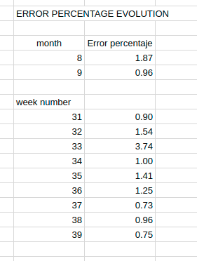
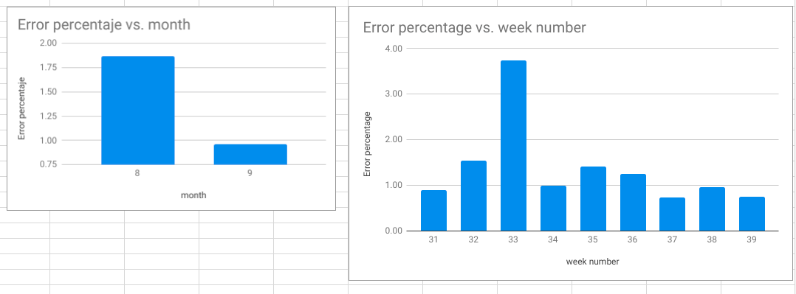
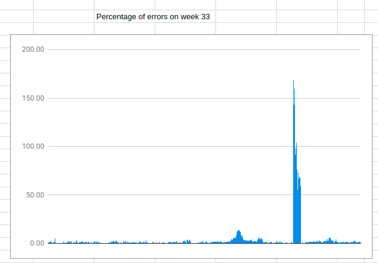
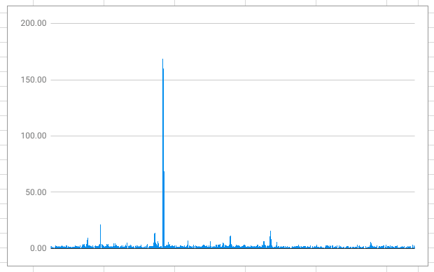

# Assignment:  Decision making

## Task
Clients complain that the searches for a destinations sometimes fail. Head of product decided to address
the issue, and ask development team to work on fix.

* The team committed to work out the solution during August. It was agreed that the team’s bonus payout
would depend on effectiveness of the solution.
* The Head of Product ask you to analyze the data and help him to decide whether the team deserve
the bonus?
* Your answer should be documented and submitted to the GitHub so that any changes can be easily
tracked.

## Useful context
* Data for Barcelona destination (18452212) is representative so that any conclusions can be extrapolated
for other destinations.


# Steps I followed & Analysis


1. Downloaded the 2 files of data we have:
```
aws s3 cp s3://data.public.bdatainstitute.com/dam18 . --recursive
```

2. Converted both Json files to CSV with an online tool (https://konklone.io/json/) and pasted on a google sheet:

[Assignment Google Sheet (read only)](https://docs.google.com/spreadsheets/d/10ACyW-WBeB19h12ZH0DQcL8VIuGCOu-6ouJH-il0DDQ/edit?usp=sharing "Assignment link")

Each log item is converted to a single row:
```
{  
   "destination_id":18452212,
   "logs":[  
      {  
         "queries":{  
            "correct":"645",
            "error":"14"
         },
         "users":"659",
         "timestamp":"2018-08-01 19:43:11"
      },
      {  
         "queries":{  
            "correct":"650",
            "error":"16"
         },
         "users":"666",
         "timestamp":"2018-08-01 19:45:24"
      },
      ...
```

Results in...
```
queries/correct,queries/error,users,timestamp
645,14,659,2018-08-01 19:43:11
650,16,666,2018-08-01 19:45:24
...
```

3. Add month and week number columns
```
=MONTH(D14)
=WEEKNUM(D14, 21)
```

4. Add percentaje of errors column
```
=100*B14/C14
```


5. Calculate error percentage per month and per week to see evolution. I used AVERAGEIF() function
```
=AVERAGEIF(E14:E5213,"=8",G14:G5213)
=AVERAGEIF($F$14:$F$5213,"="&K18,$G$14:$G$5213)
```


Notice that:
* September has 30 days but we have data until day 27 at 19h. We dont really mind since we are doing a media of error percentages.
* We have taken percentage of errors per row, and not total errors, so we dont mind not having the full day data in some cases.
* We see errors have gone from 1.87 in August to 0.96 in September

6. Added a graph to see evolution more closely


Note: Agust to September week change happens on week 35

7. Analized the graph

* If we compare August vs September, we see there is a 48.39 % decrease on the error ratio
 Difference / Original = (0.96 - 1.87) / 1.87 = 48.39% Down
 
* But on the week by week graph, I see there is a huge difference on week 33, with a 3.74 % of errors. I want to have a closer look to this week, so I have
 
* I create a new column 'error percent week 33' where only percentages of week 33 will appear.
```
=IF(F14=33, G14, )
```
I get the following chart...



And I realize there are error percentages above 100!. Something is wrong :-/ 

I get a graph with all the data I have:



I add a new column  'Is corrupted' to detect corrupt rows
```
=IF(A14+B14<>C14, 1, )
```

And I print also percentage of corrupted rows


Here we have an example of a corrupted row, where correct plus error does not match users
```
{  
         "queries":{  
            "correct":"196",
            "error":"123"
         },
         "users":"73",
         "timestamp":"2018-08-18 11:30:19"
}
```
